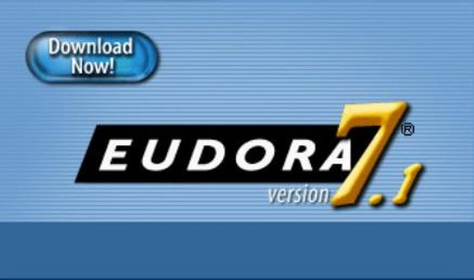
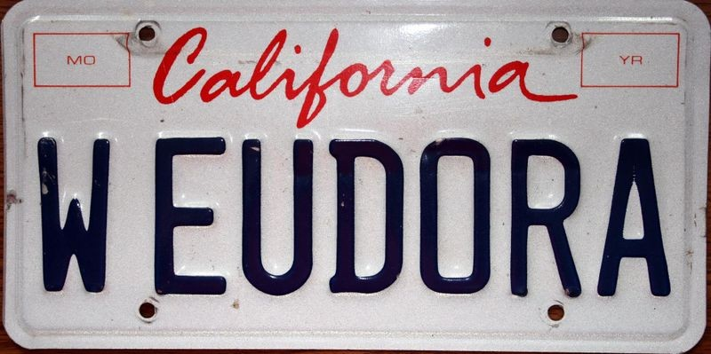
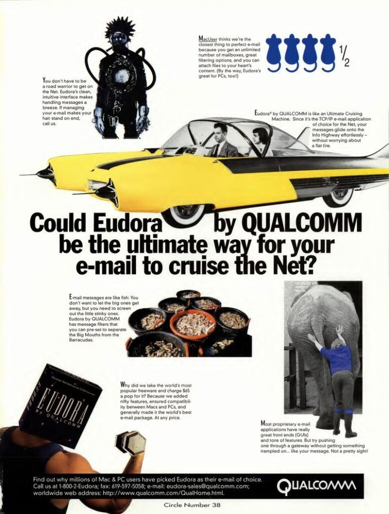
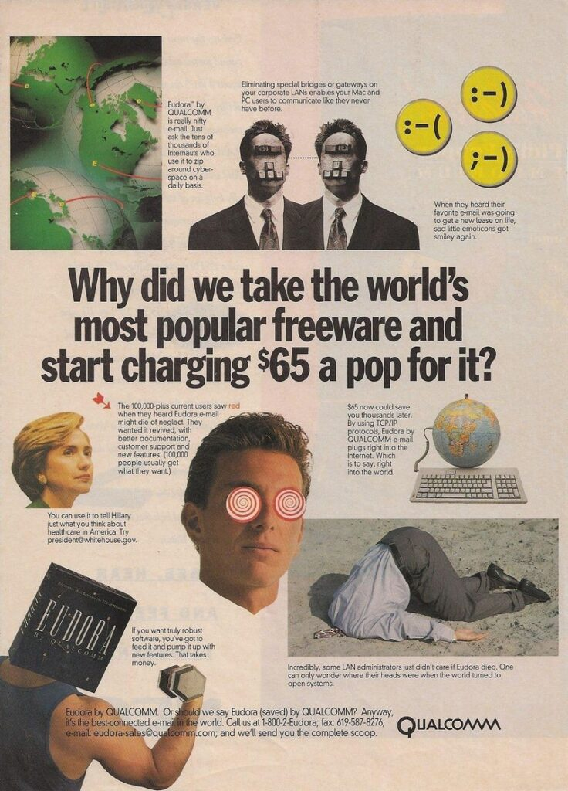
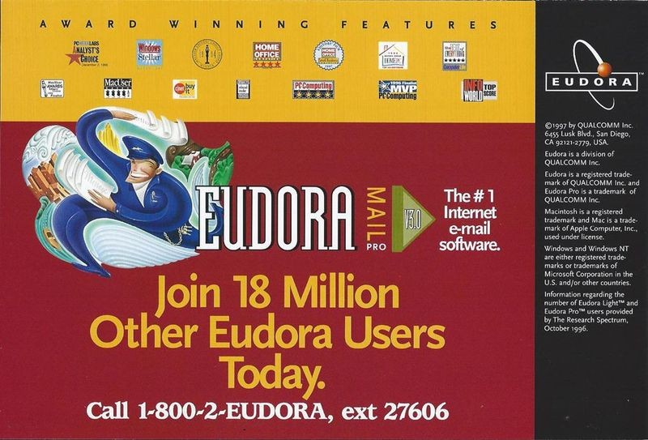
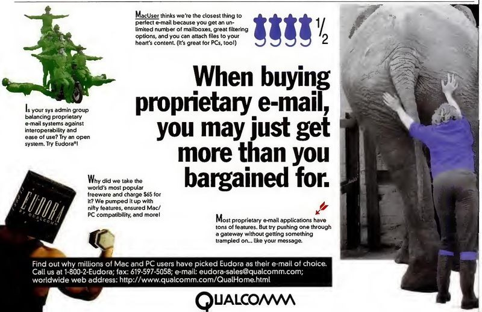

[![Contributors][contributors-shield]][contributors-url]
[![Forks][forks-shield]][forks-url]
[![Stargazers][stars-shield]][stars-url]
[![The Unlicense][license-shield]][license-url]
[![Issues][issues-shield]][issues-url]
[![LinkedIn][linkedin-shield]][linkedin-url]

---

# The Eduora Email Client Source Code

    
      
    <strong><a href="https://github.com/msammels/Eudora-Email/tree/main/src">Explore the code »</a></strong>

# About the Project
Electronic mail is one of the "killer apps" of networked computing. The ability to quickly send and receive messages
without having to be online at the same time created a new form of human communication. By now billions of people have
used email.

Email has a long and storied history, dating back to MIT's Compatible Time Sharing System
([CTSS](https://en.wikipedia.org/wiki/Compatible_Time-Sharing_System)) and the US Government's
[AUTODIN](https://en.wikipedia.org/wiki/Automatic_Digital_Network) in the early 1960s.
These early systems, which often used propriety communications networks and protocols, were generally incompatible with
each other; you could only exchange mail with people using the same system.

The first email on the ARPANET (the predecessor of today's internet) was sent by
[Ray Tomlinson](https://en.wikipedia.org/wiki/Ray_Tomlinson) in 1971, and mail formats became standardised
([RFC 524](https://datatracker.ietf.org/doc/html/rfc524),
[RFC 561](https://tools.ietf.org/html/rfc561)) soon thereafter. In the 1980s, the
[Post Office Protocol](https://en.wikipedia.org/wiki/Post_Office_Protocol) for TCP/IP codified the communication
between email clients (which run on the user's computer) and the email server (where messages are received from other
systems and stored), so that there could be independent implementations of both on different computers and operating
systems.

Eventually many email clients were written for personal computers, but few became as successful as Eudora. Available
both for the IBM PC and the Apple Macintosh, in its heyday Eudora had tens of millions of happy users. Eudora was
elegant, fast, feature-rich, and could cope with mail repositories containing hundreds of thousands of messages. In
some people's opinion it was the finest email client ever written, and it has yet to be surpassed.

Some people still use it today, but, alas, the last version of Eudora was released in 2006. It may not be long for
this world.

<a href="#">🔝</a>

# How Eudora Came To Be
In the 1980s, Steve Dorner was working at the computer centre at the University of Illinois at Urbana-Champaign.

]

> "I started Eurdora in 1988, at the University of Illinois, about fours years before I came to Qualcomm. We began it
> because the internet was a growing and burgeoning place, but email was not really established on desktop computers that
> people were using at the time. It was something that you logged in to some mainframe computer to do, and with the ease of
> use that the desktop operating systems brought, that just wasn't the right way for people to do email anymore."

It took Dorner just over a year to create the first version of Eudora, which had 50,000 lines of C code and ran only on
the Apple Macintosh. Like many university-produced programs, it was available to anyone for free.

Why did he call it Eudora? Dorner explained for a 1997 article in the
[New York Times CyberTimes](https://archive.nytimes.com/www.nytimes.com/library/cyber/week/012197eudora.html) that it
was because of a short story he had read in college:
"[Why I Live at the P.O](https://en.wikipedia.org/wiki/Why_I_Live_at_the_P.O.)" by Mississippi writer Eudora Welty.
Working intently on an email program, Dorner said

> "I felt like I lived at the post office."

In 1991, Qualcomm, a communications company in San Diego famous for CDMA cellular communications technology, licensed Eudora
from the University of Illinois. Dorner was eventually hired by them to continue to develop it, working remotely from his
home in Illinois.

Qualcomm’s motivations were several. They knew that the internet would fuel the need for wireless data, and they thought
that email would be one of the drivers. They also thought it prudent to diversify beyond ICs for wireless technology into
software applications.

But Eudora as a Mac-only product wouldn’t cut it. Qualcomm project manager John Noerenberg assigned Jeff Beckley and
Jeff Gehlhaar in San Diego the task of making an MS-DOS and then a Windows version of the program.

> “The style of the company was to put an MS-DOS or Macintosh computer on each employee’s desk—whichever most suited
> their needs and their personal preference,”

he said.

> “We required email software that was internet-savvy, and platform agnostic. There wasn’t anything commercially available
> that satisfied either of those goals, much less both.”

Initially Eudora was only used internally at Qualcomm. It was well-received. Noerenberg heard one financial executive at 
Qualcomm saying,

> “I used to hate email. But I love Eudora!!”

and observed,

> “It was at that moment I realized we were on to something.”

The company later said,

> “As a leader in developing and delivering digital communications, Qualcomm recognized email as an important communications
> tool for the future,”

and they released it as a consumer product in 1993. The Eudora team at Qualcomm expanded quickly from the initial four to
a moderately large product group, and at its peak was over 50 people.

<a href="#">🔝</a>

# The Rise of Eudora
The Qualcomm version of Eudora was originally available for free, and it quickly gained in popularity. To get a feel for
the user community, Beckley called it “postcard-ware” and asked people to send him a postcard if they liked it.

> “I got thousands of postcards from all over the world. . . . There was this great feeling about the software, and
> everybody really loved it.”

> “But,”

Noerenberg recalls,

> “postcards don’t pay the bills.”

He faced management pressure to stop spending money on a free product.

> “In 1993 I hatched the idea that if we could somehow convince Qualcomm there was money in an internet software business,
> we could turn this into a product and we’d get to keep doing what we loved.”

Eudora was soon commercialized as a paid version for $19.95. There was still a free version, now supported by
advertisements. By 2001, over 100 person-years of development had been invested in the Windows and Macintosh versions.
The paid version eventually sold for as much as $65, and it was aggressively marketed by Qualcomm.

<a href="#">🔝</a>

# The Demise of Eudora
After 15 years, Qualcomm decided in 2006 that Eudora was no longer consistent with their other major project lines, and
they stopped development. A likely factor was the increasing adoption of Microsoft Outlook as an email client for
corporations. Outlook was preloaded for free on many PCs, and companies often standardized on it along with the rest of
the Microsoft suite of office productivity products. Other free email clients were also available. So regardless of how
successful Eudora was, it was never going to be a business big enough to “move the needle” for a company of Qualcomm’s size.

The last Qualcomm versions of Eudora, 7.1.0.9 for Windows and 6.2.4 for Macintosh, were released on October 11, 2006.

To provide a “soft landing” for the millions of Eudora users, Qualcomm generously sponsored the creation of a new
compatible open-source version based on Mozilla Thunderbird. For some time they paid the salaries of the programmers
working on it, which included Steve Dorner, Jeff Beckley, Dale Wiggins, Geoff Wenger, Matt Dudziak, and Mark Charlebois.

A beta of the new version 8.0 was released in August 2007. But it was panned by the Eudora faithful, in part because it
had both a different look and feel and an incompatible mailbox data format. The production version 1.0 of what was
renamed “Eudora OSE” (Open Source Edition) was released in September 2010, but fared no better.

Jeff Beckley mused that “Classic Eudora had many years of very detailed design and implementation in it. There are a lot
of little things that go on behind the scenes, or at least very subtly visible to the user. Users come to depend on those
subtle interactions, and, when they aren’t there, it just feels different.”

After a few more years of intermittent work, the project for an open-source Eudora collapsed.

The last Qualcomm Windows version of Eudora continues, with some glitches, to work well under Windows 10. The Apple
Macintosh version, unfortunately, did not survive the transition to the modern Mac processors and operating systems, and
can now only run using emulators.

<a href="#">🔝</a>

# Eudora's Legacy
It’s hard to overstate Eudora’s popularity in the mid-1990s. The April 22, 1996 InfoWorld article announcing the release
of Eudora Pro 2.0 called it Qualcomm’s “best-selling product,” and said that

> “according to International Data Corp. (IDC), Qualcomm claimed 64.7 percent of all e-mail software revenues in 1995.”

A later exhibit about Eudora in Qualcomm’s company museum observed that

> “By 1996 Eudora had 18 million users, making it the world’s most widely used internet email software at the time.”

Even though it has mostly faded away, Eudora had a lasting impact. As Dorner says,

> “It had a great effect on how people do email even today. There are concepts that we introduced, which we were the first
> to do, that are now a standard part of any email client out there.”

<a href="#">🔝</a>

# The Eudora Source Code
The Windows version of Eudora is written in C++. The source tree consists of 8,651 files in 565 folders, taking up 458 MB.
There are both production (“Eudora71”) and test (“Sandbox”) versions of the code.

The Macintosh version of Eudora is an entirely different code base and is written in C. The source tree consists of
1,433 files in 47 folders, taking up 69.9 MB.

<a href="#">🔝</a>

# Reviving the Windows version of Eudora
Although Eudora became unsupported as of 2006, some of us are in denial and still use it as our primary email client.
Some people have over 350,000 archived messages in the Windows Eudora format going back to 1997, along with 28,000 embedded
images and 33,000 saved attachments. They are able to run it with only minor problems under Windows 10.

I know of no other email client that can manage repositories that large and search them so quickly. Some people spend hours
each day using Eudora to read and send email. They can do a complex search for anything in the 20 years of archived email
in under a minute. It will be a sad day when they have to give it up.

I do hope that someone, or some group, or some company, will adopt the Windows Eudora source code and revive it as a
supported program. The Computer History Museum cannot do that. Only the Eudora fan base can.

It won’t be easy. The tasks in reviving the Windows version include replacing several third-party libraries for isolated
tasks, like spell-checking. The HTML rendering engine should be replaced with something more modern. The handling of
Unicode and other special character encoding needs to be improved.

Also, the Windows version uses a Qualcomm-modified version of RogueWave Software’s Stingray package of extensions to MFC,
the Microsoft Foundation Class library for C++. After more than three years of discussion, we finally secured an agreement
with RogueWave, giving us permission to distribute a binary linkable library compiled from the 20-year-old source code,
but only for noncommercial use. That library is not currently part of this release, but we will build and distribute it if
there is credible interest in rebuilding a noncommercial Windows version of Eudora. But it will take some effort to make
the changes to the RogueWave source code necessary to compile it in a modern development environment, and we could use
help in doing that.

<a href="#">🔝</a>

# Reviving the Macintosh version of Eudora
The Macintosh version, because it is based on an older processor and operating system, would be harder to resuscitate.
It would have to be substantially rewritten for the current Mac environment. But not much is beyond the capability of
motivated and clever programmers. Have at it.

Long live Eudora!

<a href="#">🔝</a>

# Contact
Michael Sammels - [@msammels](https://twitter.com/msammels) | michael@sammels.net

(<a href="#top">Back to top</a>)

[contributors-shield]:  https://img.shields.io/github/contributors/msammels/Eudora-Email?style=for-the-badge
[contributors-url]:     https://github.com/msammels/Eudora-Email/graphs/contributors

[forks-shield]:         https://img.shields.io/github/forks/msammels/Eudora-Email?style=for-the-badge
[forks-url]:            https://github.com/msammles/Eudora-Email/network/members

[stars-shield]:         https://img.shields.io/github/stars/msammels/Eudora-Email?style=for-the-badge
[stars-url]:            https://github.com/msammels/Eudora-Email/stargazers

[issues-shield]:        https://img.shields.io/github/issues/msammels/Eudora-Email?style=for-the-badge
[issues-url]:           https://github.com/msammels/Eudora-Email/issues

[license-shield]:       https://img.shields.io/github/license/msammels/Eudora-Email.svg?style=for-the-badge
[license-url]:          https://github.com/msammels/Eudora-Email/blob/main/LICENSE

[linkedin-shield]:      https://img.shields.io/badge/-LinkedIn-black.svg?style=for-the-badge&logo=linkedin&colorB=555
[linkedin-url]:         https://linkedin.com/in/msammels
